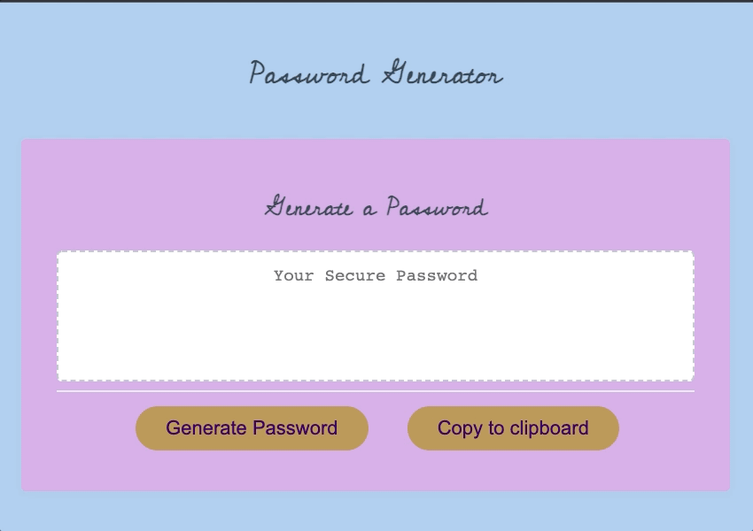

[![Contributors][contributors-shield]][contributors-url]
[![Forks][forks-shield]][forks-url]
[![Stargazers][stars-shield]][stars-url]
[![Issues][issues-shield]][issues-url]
[![MIT License][license-shield]][license-url]
[![LinkedIn][linkedin-shield]][linkedin-url]

# Password Generator
<!-- PROJECT LOGO -->
 

  

<h3 align="center">Password Generator</h3>

  

    this will help client randomly generate a password that needs certain criteria
     
    <a href="https://github.com/micsdz/Micah-Portfolio-Website"><strong>Explore the docs »</strong></a>
     
     
    <a href="https://micsdz.github.io/password-generator/">View Demo</a>
    ·
    <a href="https://github.com/micsdz/password-generator/issues">Report Bug</a>
    ·
    <a href="https://github.com/micsdz/password-generator/issues">Request Feature</a>
  

## Description:
I created a web application that will help client generate 
  a random password that they can choose an option to add different criteria.
This password generator can:
- can generate password between 8-128 characters
- has prompts for you to choose to add lowercase, uppercase, numeric and special characters
- has a button to let you copy your generated password

## Appearance and Functionality

Website's Appearance:

### Built With

* [HTML](https://en.wikipedia.org/wiki/HTML)
* [CSS](https://developer.mozilla.org/en-US/docs/Learn/CSS/First_steps/What_is_CSS)
* [Javascript](https://www.javascript.com)

(<a href="#top">back to top</a>)

## Project Link
[Portfolio Repository](https://github.com/micsdz/password-generator)

[Portfolio Live Website](https://micsdz.github.io/password-generator/)

## Contact Info
Micah Diaz - micah.diaz@du.edu

(<a href="#top">back to top</a>)

<!-- MARKDOWN LINKS & IMAGES -->
<!-- https://www.markdownguide.org/basic-syntax/#reference-style-links -->
[contributors-shield]: https://img.shields.io/github/contributors/github_username/repo_name.svg?style=for-the-badge
[contributors-url]: https://github.com/github_username/repo_name/graphs/contributors
[forks-shield]: https://img.shields.io/github/forks/github_username/repo_name.svg?style=for-the-badge
[forks-url]: https://github.com/github_username/repo_name/network/members
[stars-shield]: https://img.shields.io/github/stars/theresaqueryforthat/website_accessibility_refactor.svg?style=for-the-badge
[stars-url]: https://github.com/theresaqueryforthat/website_accessibility_refactor/stargazers
[issues-shield]: https://img.shields.io/github/issues/theresaqueryforthat/website_accessibility_refactor.svg?style=for-the-badge
[issues-url]: https://github.com/theresaqueryforthat/website_accessibility_refactor/issues
[license-shield]: https://img.shields.io/github/license/theresaqueryforthat/website_accessibility_refactor.svg?style=for-the-badge
[license-url]: https://github.com/theresaqueryforthat/website_accessibility_refactor/blob/master/LICENSE.txt
[linkedin-shield]: https://img.shields.io/badge/-LinkedIn-black.svg?style=for-the-badge&logo=linkedin&colorB=555
[linkedin-url]: https://www.linkedin.com/in/mdiaz06/

